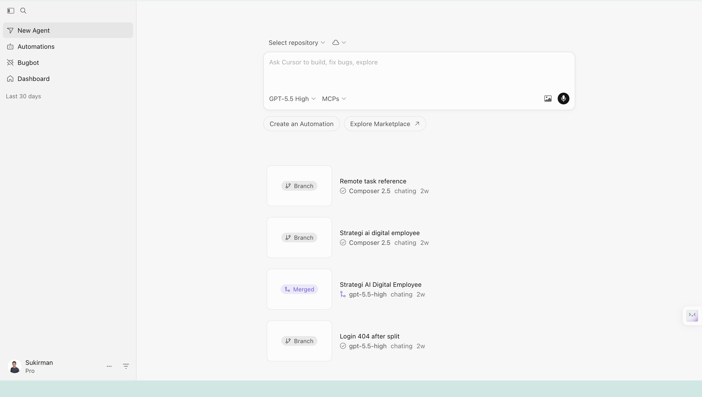

# opencode-manager

Web UI for managing [OpenCode](https://opencode.ai) models, providers, plugins, agents, and usage — with a built-in chat interface.

## Features

- **Model & Provider Management** — Add, edit, delete models and providers across all config files
- **Plugin & Agent Management** — Install/uninstall plugins, configure agents
- **Usage Dashboard** — Token usage, cost breakdown by model/provider
- **Sessions Viewer** — Browse, search, and inspect past sessions with full message history
- **Chat Interface** — Send prompts to any configured model (streaming support)
- **Multi-Config Merge** — Reads all OpenCode config files (`~/.config/opencode/`, `~/.opencode/`), merges and writes to the correct file
- **Auto-Detection** — Finds config files, database path, and SDK client automatically

## Screenshot



## Installation

```bash
# Clone the repo
git clone https://github.com/sukirman1901/opencode-manager.git
cd opencode-manager

# Install dependencies
npm install

# Start the server
npx tsx index.ts
```

Or install as an OpenCode plugin — add to your `opencode.json`:

```json
{
  "plugins": ["/path/to/opencode-manager"]
}
```

## Usage

Open **http://localhost:2084** in your browser.

### Tabs

| Tab | Description |
|-----|-------------|
| **Models** | View/switch models, add/edit/delete providers and models |
| **Plugins** | Manage installed plugins and agents |
| **Usage** | Token usage dashboard with daily/weekly/monthly views |
| **Sessions** | Browse past sessions with search and detail view |
| **Chat** | Interactive chat with model switching |

### Environment Variables

| Variable | Default | Description |
|----------|---------|-------------|
| `OPENCODE_MANAGER_PORT` | `2084` | Web server port |

## Requirements

- [Bun](https://bun.sh/) or [Node.js](https://nodejs.org/) 18+
- [OpenCode](https://opencode.ai) CLI installed (`~/.opencode/` or system path)

## How It Works

The tool reads OpenCode's configuration files (~/.config/opencode/opencode.json, ~/.opencode/config.json), merges them, and provides a UI to manage their contents. It also connects to OpenCode's local SQLite database (~/.local/share/opencode/opencode.db) for session and usage data.

For the chat feature, it uses the OpenCode SDK client to create sessions and send prompts to the configured model.

## License

MIT

## Credits

Created by **sukirman**
